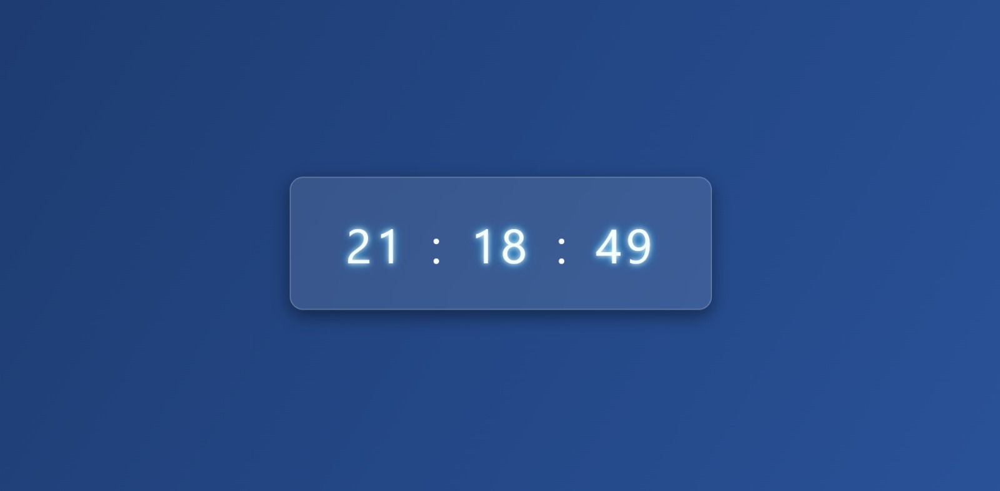

# Tarayıcıda Dijital Saat

Bu proje, JavaScript, HTML ve CSS kullanarak basit ama şık bir **tarayıcı saati uygulamasıdır**. Kullanıcıların tarayıcıda canlı olarak saat bilgisine ulaşmasını sağlar. Ayrıca CSS ile görsel efektler (parlama ve nefes alma animasyonu) eklenerek daha modern bir görünüm sunulmuştur.

## 🔧 Kullanılan Teknolojiler

- HTML5
- CSS3 (Animasyonlar ve tasarım için)
- JavaScript (Tarih/saat bilgisi ve DOM güncellemeleri için)

## 🎯 Amaç

Bu proje, **JavaScript öğrenme sürecimde** temel kavramları pekiştirmek için hazırlanmıştır. O dönemde oluşturduğum ama paylaşmadığım çalışmalardan biriydi, şimdi düzenleyip GitHub'a ekliyorum. Projenin amacı:

- `Date` nesnesi ile saat ve zaman yönetimini öğrenmek,
- `setInterval()` ile canlı veri güncellemeyi uygulamak,
- DOM manipülasyonlarını pratik etmek,
- CSS animasyonlarıyla görsel etki kazandırmaktı.

## 📸 Ekran Görüntüsü

## ⚙️ Nasıl Çalışır?

1. Her saniyede bir `tick` fonksiyonu tetiklenir.
2. JavaScript `Date` objesi ile anlık saat bilgisi alınır.
3. `innerHTML` ile `.clock` div'ine saat bilgisi yazdırılır.
4. CSS ile bu saat bilgisi görsel olarak animasyonlu şekilde gösterilir.

## 🚀 Geliştirme Fikirleri

İleride bu projeye şu özellikler eklenebilir:
- Analog saat görünümü
- Gün / ay / yıl bilgisi
- Tema değiştirme (dark/light)
- Alarm veya geri sayım modu