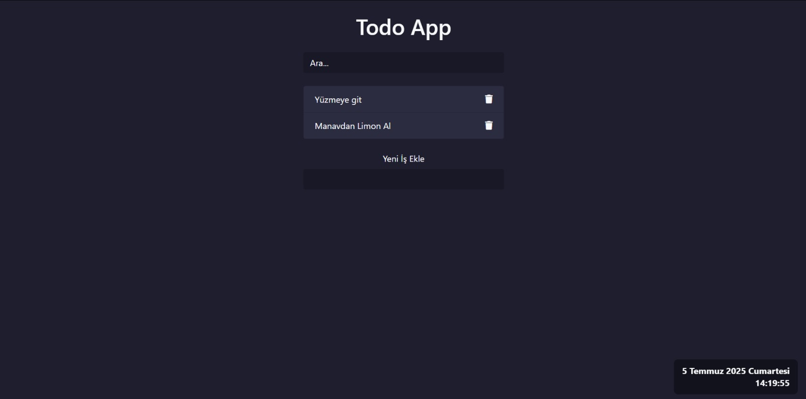

# Todo Uygulaması

Bu proje basit bir **"Yapılacaklar Listesi" (Todo App)** uygulamasıdır. HTML, CSS ve JavaScript kullanılarak geliştirilmiştir. Kullanıcılar yeni görevler ekleyebilir, görevleri silebilir ve liste içerisinde arama yapabilir. Ayrıca ekranın sağ alt köşesinde canlı bir saat yer almaktadır.

## Özellikler

- ✔️ Görev ekleme
- ❌ Görev silme
- 🔍 Canlı arama filtresi
- ⏰ Gerçek zamanlı saat göstergesi
- 🎨 Bootstrap destekli şık tasarım
- 💡 Animasyonlarla kullanıcı deneyimini artırma

## Ekran Görüntüsü

